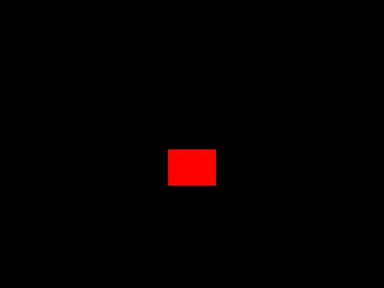
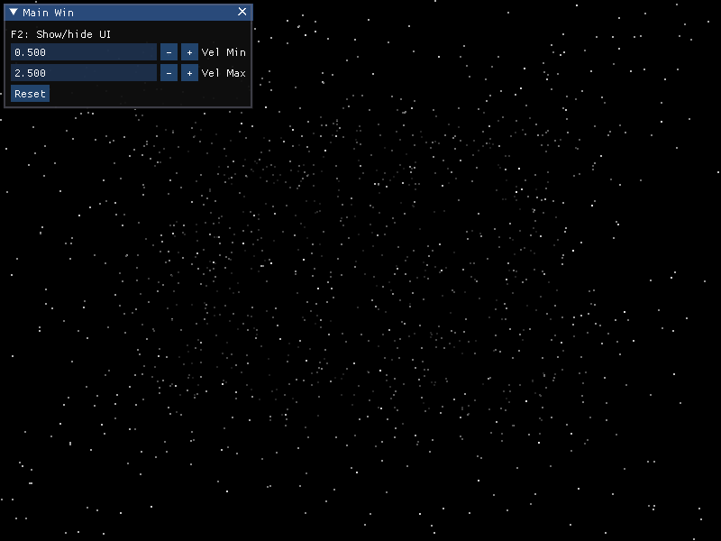
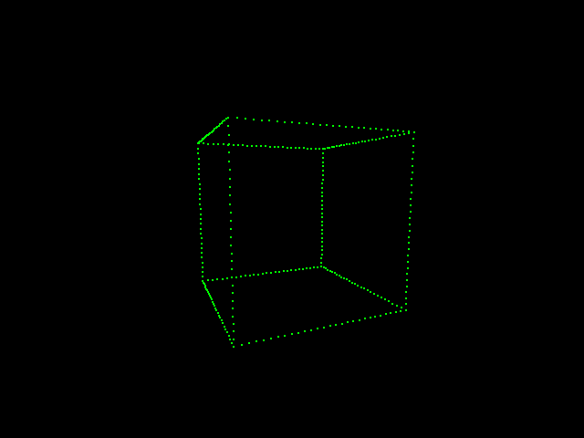
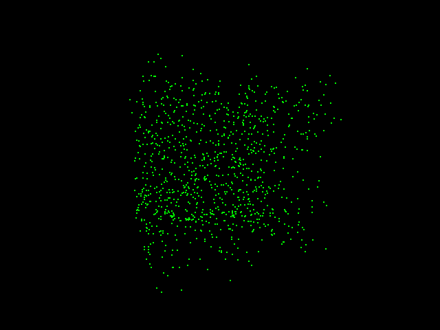
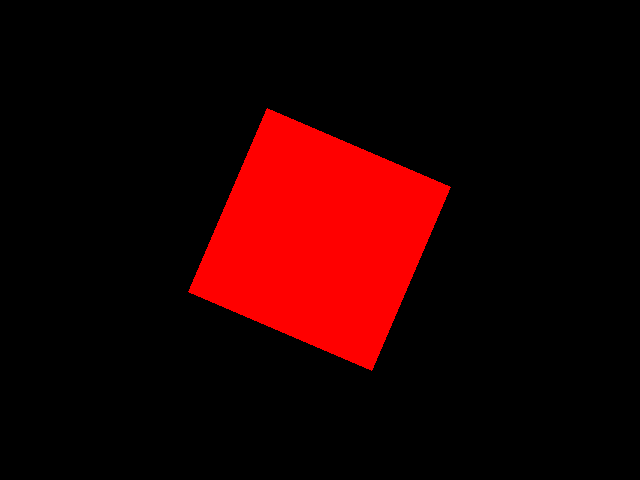
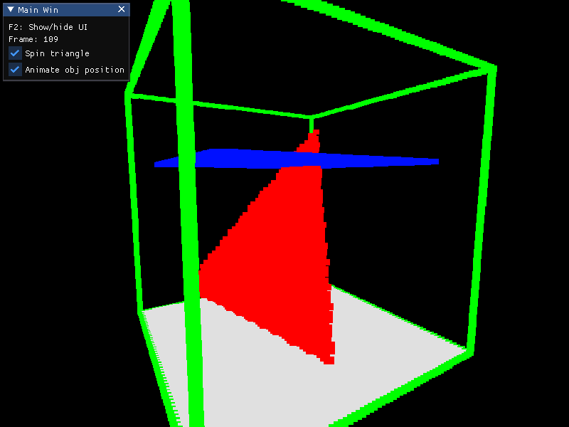

## Demos

|  |  |
|---|---|
| **Demo1**: A moving red rectangle  | **Demo2**: A 3D starfield (no *glm* for 3D)  |
| **Demo3**: A wire-frame cube made of particles  | **Demo4**: A cube made with random particles  |
| **Demo5**: A 2D rotating quad  | **Demo6**: A simple voxel scene  |

## Required Tools
- [Git](https://git-for-windows.github.io/) with Git Bash
- [CMake](https://cmake.org/download/)
- For Windows: Visual Studio
- For Mac: Xcode (untested)
- For Linux: gcc, etc.

If you're on Windows. All commands are meant to run under Git Bash, not MS-DOS.

## Quick Start

### 1) Get the external dependencies
```bash
./get_externals.sh
```

### 2) Do a full build
You should do a full-build at least once via command line so that SDL DLLs
are created, both for Release and Debug:
```bash
./build.sh -t Debug
./build.sh -t Release
```
Executables can now be found under `_bin`.

### Using the VS solution
1. The solution is located in `_build\win\dpasca-sdl2-template.sln`
2. From *Solution Explorer*, right click on **Demo1** and choose *"Set As StartUp Project"*
3. Press F7 to build the selected project

### Updating the VS solution or makefiles
This will refresh the makefiles or IDE projects for when sources are added or removed.
```bash
./build.sh -d
```

